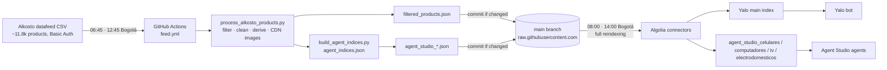

# Alkosto → Algolia product feed

Automated pipeline that turns Alkosto's full product datafeed into curated,
enriched Algolia indices for the Yalo WhatsApp bot and for Algolia Agent Studio
agents. Runs twice a day on GitHub Actions with no manual steps.

Team-facing documentation in Spanish (architecture, daily cycle, runbook,
onboarding, timeline): [`docs/pipeline.es.md`](docs/pipeline.es.md) — also
published as a formatted page at
[claude.ai](https://claude.ai/code/artifact/ee158764-72ef-4810-810d-1d3369374056).
This README is the developer reference and the source of truth for behaviour.

## Getting started

1. **Access:** collaborator on this repository (granted by Philipp Hasskamp);
   member of Algolia application `QX5IPS1B1Q` able to create API keys and
   connectors; optionally the `gh` CLI, authenticated.
2. **Local setup:**

   ```bash
   git clone https://github.com/Wunderbot-Git/alkosto-yalo-feed && cd alkosto-yalo-feed
   python3.12 -m venv .venv && source .venv/bin/activate
   pip install -r requirements.txt
   cp .env.example .env   # create your own restricted Algolia keys; never commit .env
   ```

3. **Run the pipeline locally** (to test a category change before pushing):

   ```bash
   ALKOSTO_USERNAME=… ALKOSTO_PASSWORD=… python process_alkosto_products.py   # downloads productFeed.csv
   python process_alkosto_products.py --skip-download                          # reuses the downloaded CSV
   python replace_image_urls.py filtered_products.json
   python build_agent_indices.py --input filtered_products.json --config agent_indices.json
   ```

   The CSV and `filtered_*.csv` are git-ignored; only the JSON outputs are
   committed, and the workflow does that.
4. **Two rules before your first change:** every relevance change in Algolia
   ends in a commit (see *Algolia configuration as code*); every category change
   is verified in the published JSON before touching Algolia (see *Extending*).

## Architecture



Key idea: **one main feed, many derived views.** Every index is a slice of
`filtered_products.json`, so all indices share the same cleaning and derived
fields and a category added once shows up everywhere it belongs.

## Repository layout

| Path | Role |
|---|---|
| `.github/workflows/feed.yml` | The schedule and the steps. Commits outputs only when they changed. |
| `process_alkosto_products.py` | Main pipeline. Holds `CATEGORY_PREFIXES` (what enters) and `TIPO_PRODUCTO_PREFIXES` (category path → `tipo_producto`). |
| `replace_image_urls.py` | Rewrites `Enlace link1/link2` to the static CDN: `cdn.dam.alkosto.com/products/<EAN>/<EAN>-001.webp`. |
| `agent_indices.json` | One entry per Agent Studio index: which `tipo_producto` values it contains and which attributes the agent sees. |
| `build_agent_indices.py` | Writes `agent_studio_<name>.json` for every entry above. |
| `transform_to_schema.py` | Lean agent schema (English field names, numeric value + display label per spec). Used by `agent_studio_computadores`. |
| `filter_subset.py` | Generic subset by `tipo_producto`. Produces `filtered_computadores_tablets.json`. |
| `algolia/<index>/` | Versioned Algolia configuration: `settings.json`, `synonyms.json`, `rules.json` per index. |
| `scripts/export_algolia_config.py` | Pulls the live configuration of all indices into `algolia/`. Run after changing anything in the dashboard. |
| `scripts/apply_algolia_config.py` | Pushes `algolia/<index>/` to the live index; `--load file.json` bootstraps a new index. |
| `scripts/wait_for_fresh_feed.py` | Workflow step: downloads the CSV, retrying until it differs from `feed.sha256`. |
| `scripts/trigger_connectors.py` | Workflow step: runs every Algolia connector sourced from this repo after a commit and waits for the results. |
| `feed.sha256` | Fingerprint of the last processed CSV (written by the workflow). |
| `scripts/algolia_common.py` | Key selection per index + minimal REST client. |
| `.env.example` | Variables for the local admin scripts. Copy to `.env` (git-ignored). |

## Daily schedule

Bogotá is UTC−5. Since 2026-09-07 the refresh is **event-driven**: an external
scheduler starts the workflow at an exact time, and the workflow itself reloads
every Algolia index as soon as the new JSON is published. GitHub's own cron and
the connectors' crons stay only as backstops.

| Step | When (Bogotá) | Mechanism |
|---|---|---|
| Trigger | 07:00 · 13:00 | cron-job.org calls `POST …/actions/workflows/feed.yml/dispatches` (`workflow_dispatch`) with a fine-grained GitHub token (Actions: read/write, this repo only). Dispatched runs start within seconds; *scheduled* runs do not. |
| Fresh-feed check | +0 – 30 min | `scripts/wait_for_fresh_feed.py` re-downloads every 10 min until the CSV's SHA-256 differs from `feed.sha256` (the previous run's file), then proceeds. |
| Process + commit | +30 s | unchanged; the commit step exposes `pushed=true/false`. |
| Reload indices | +6 min | `scripts/trigger_connectors.py`: waits 330 s for the raw-URL CDN cache, then runs every connector whose source is a file in this repo (discovered dynamically, no list to maintain) and waits for the results. Any failed ingestion turns the run red. Skipped when nothing was pushed unless `force_reload` is set. |
| **Prices live** | **≈ 07:08 · 13:08** | measured 7 min 20 s end-to-end on 2026-09-07. |

Backstops: GitHub cron `0 13,19 * * *` (08:00 · 14:00 Bogotá, an hour after the
real trigger; a no-op when the CSV is unchanged) and connector crons
`0 13,19 * * *` (both UTC). If the external trigger fails, the day still
refreshes — just later. Runs are serialised (`concurrency: feed-refresh`), so an
overlapping backstop run queues instead of racing the push.

Why this exists: on 3–6 Sep 2026 GitHub's scheduled runs started 2–3.5 h late
and the fixed-cron connectors ingested the previous cycle every time; Aug 2026
had the same failure with a 40-minute delay. Any fixed gap eventually loses.

## Outputs (committed to `main`)

Public URLs: `https://raw.githubusercontent.com/Wunderbot-Git/alkosto-yalo-feed/main/<file>` (CDN, 5 min cache).

| File | ~Records | Consumer |
|---|---|---|
| `filtered_products.json` | 4,980 | Main Yalo index (`Yalo_computadores_tables_monitores_impresores_pantallas`) |
| `agent_studio_celulares.json` | 440 | `agent_studio_celulares` |
| `agent_studio_computadores.json` | 460 | `agent_studio_computadores` (lean schema) |
| `agent_studio_tv.json` | 250 | `agent_studio_tv` |
| `agent_studio_electrodomesticos.json` | 940 | `agent_studio_electrodomesticos` |
| `filtered_computadores_tablets.json` | 350 | none currently |
| `filtered_agente_computadores.json` | 460 | `Philipp_Alkosto_AI` — a separate prototype/sandbox index (see *Indices*) |

## Indices

| Index | Content | Format | Connector unique ID |
|---|---|---|---|
| `Yalo_computadores_tables_monitores_impresores_pantallas` | 14 category trees, 106 `tipo_producto` values | raw + derived | `Identificador del producto` |
| `agent_studio_celulares` | smartphones | raw + derived | `Identificador del producto` |
| `agent_studio_computadores` | laptop, desktop, all_in_one, tablet, monitor, impresora, tinta, papel, proyector | lean schema | `objectID` |
| `agent_studio_tv` | televisor, barra_sonido, proyector | raw + derived | `Identificador del producto` |
| `agent_studio_electrodomesticos` | refrigeration, laundry, cooking (floor + built-in), climate | raw + derived | `Identificador del producto` |

Overlap between agent indices is intentional (soundbars live in TV and, later,
Audio). The main index name is historical; Yalo's integration depends on it.

`Philipp_Alkosto_AI` (the name carries a trailing space) is a **prototype
sandbox**, not part of production. It is fed by `filtered_agente_computadores.json`
(same lean schema and scope as `agent_studio_computadores`) so it always has
current data, but its relevance configuration is deliberately independent:
it is not exported to `algolia/`, not touched by the admin scripts, and changes
made there never propagate to the Yalo or Agent Studio indices. Keep it that way.

### Record formats

**Raw + derived** — Alkosto's original Spanish columns (`Título`, `Marca`,
`Memoria RAM`, …), empty attributes dropped, plus the derived fields below.

**Lean schema** (`transform_to_schema.py`) — English names, every measurable
spec stored twice (`ram_gb: 16` for filtering, `ram_label: "16 GB"` for
display), controlled enums (`category`, `os`, `cpu_brand`, `gpu_brand`), real
booleans. Conservative: a boolean is only emitted when the source text carries a
clear signal; nothing is fabricated. Design reference: the June 2026 schema
document ("facts in the index, interpretation in the agents").

### Derived fields (all raw indices)

| Field | Type | Source | Notes |
|---|---|---|---|
| `tipo_producto` | string | category path prefix | Central routing key for rules, subsets, filters. New brands under a mapped prefix flow through automatically. |
| `descuento_porcentaje` | int | `(lista − venta) / lista × 100`, **truncated** | Matches alkosto.com (56.52 → 56). `round()` disagreed with the site. |
| `precio_<method>` | int | `Precio por método de pago` = `codensa:2518070;tarjeta_alkosto:2498070` | One field per method, discovered dynamically. |
| `metodos_pago` | string[] | same | Facet. |
| `screen_size_inches` | float | `Tamaño Pantalla_2` (monitors, TVs) then `_1`; cm → inches fallback | TVs keep centimetres in `_1`. |
| `Enlace link1/2` | URL | rewritten | Deterministic CDN path from the EAN. |

Cleaning applied before that: all-empty columns dropped (~920 → ~110); per
record, empty and NaN attributes dropped; the EAN is read as text so leading
zeros survive (`010343958098`).

## Algolia configuration as code

`algolia/<index>/` holds what matters per index: searchable attributes,
faceting, numeric filters, custom ranking, `attributesToRetrieve`, Spanish
language settings, all synonyms and all rules.

```bash
cp .env.example .env            # fill in the keys
python scripts/export_algolia_config.py               # dashboard → repo (all indices)
python scripts/apply_algolia_config.py agent_studio_tv # repo → index
python scripts/apply_algolia_config.py agent_studio_audio --load agent_studio_audio.json  # bootstrap a new index
```

Conventions that hold today:

- Spanish everywhere: `queryLanguages`, `removeStopWords`, `ignorePlurals` = `["es"]`.
- 44 shared synonym groups (portátil↔laptop, nevera↔refrigerador, airfryer↔freidora de aire, mouse↔ratón, …).
- Rules map a query word to a `tipo_producto` filter (`portátil` → `laptop`, `refrigerador` → `nevera OR nevecon`). The main index has ~47; each agent index carries **only** the rules whose target types it contains — a foreign rule in a small index yields zero results.
- Agent indices trim `attributesToRetrieve` to the vertical's relevant fields (list in `agent_indices.json`); agents receive every hit in context, so fewer attributes is better retrieval.
- Custom ranking: main index `desc(Disponibilidad)`; agent indices add `desc(descuento_porcentaje)`; computadores uses `desc(stock), desc(discount_pct)`.

Change the config in the repo and `apply`, or change it in the dashboard and
`export` — either way commit the result so the two never drift.

## Extending

**Add a category to the main index.** Find the exact path (the workflow log
lists every matched subcategory). Add its prefix to `CATEGORY_PREFIXES` and one
line per subcategory to `TIPO_PRODUCTO_PREFIXES` (specific paths before generic
ones). Push, check the published JSON for the new `tipo_producto` and for
records left without one, then add a rule and synonyms in `algolia/…` and apply.

**Add an Agent Studio index.** Add an entry to `agent_indices.json` (name with
the `agent_studio_` prefix, `tipos`, `attributes`). Push. Create the index
config folder (copy a sibling's), `apply --load`, then create the connector in
the Algolia dashboard: JSON source at the raw URL, unique ID as in the table
above, *Create one for me* credentials, cron `0 13,19 * * *`, full reindexing.
Planned next: audio, pequeños electrodomésticos, videojuegos, smart home +
cámaras, accesorios.

**Add a derived field.** In `convert_to_json` of `process_alkosto_products.py`,
inside the per-record loop, before the empty-attribute cleanup. Store facts
(inches, litres, percentages), never judgements ("good for gaming").

## Operations

Check a day: <https://github.com/Wunderbot-Git/alkosto-yalo-feed/actions> shows two
green runs; `main` has fresh `feed: refresh …` commits; Algolia → Connectors →
Connector Debugger shows each ingestion with its record count.

```bash
gh run list --workflow=feed.yml --repo Wunderbot-Git/alkosto-yalo-feed --limit 6
gh workflow run feed.yml --repo Wunderbot-Git/alkosto-yalo-feed   # manual run
```

Daily health report: `.github/workflows/health-report.yml` runs
`scripts/health_report.py` at 07:20 and 13:20 Bogotá (triggered by cron-job.org,
like the feed — a GitHub schedule would be hours late) and emails `MAIL_TO` via
Gmail SMTP. It checks the trigger source (dispatch vs. backstop cron), the run
and its reload step, when the CSV last changed, and every production index's
record count and latest connector ingestion. Subject starts with ✅ / ⚠️ / ❌;
one line per check in the body.

Force a refresh: Actions → *Run workflow* → tick **`force_reload`** (and untick
`wait_for_fresh` to skip the up-to-30-min wait). The run downloads, publishes and
reloads every index by itself; nothing to click in Algolia.

Known failure modes:

| Symptom | Cause | Fix |
|---|---|---|
| Prices one cycle behind | The external trigger did not fire (cron-job.org history) so only the late backstop cron ran; or the reload step failed (run is red, email sent) | Actions → *Run workflow* with `force_reload`; fix the trigger or read the failing step's log |
| Workflow started long after 07:00 | The run came from GitHub's backstop cron (`schedule` event), not from cron-job.org (`workflow_dispatch`) | Check the job and token in cron-job.org; a `401` there means the token expired (2027-09-07) — regenerate and paste it back |
| Connector "success", index unchanged, tasks `notPublished` | Algolia plan record limit reached; writes silently dropped | Settings → Usage; free records or upgrade (Apr 2026) |
| Product "missing" from index | Searching the EAN as text; it's not a searchable attribute | Look it up by `objectID`; if truly absent, check `CATEGORY_PREFIXES` |
| 403 on a new index although the key allows it | Trailing space in the index or key restriction name (happened twice) | Type the name and press Enter; verify via the keys API |
| Zero results for a vertical word in an agent index | A foreign rule was copied in | Keep only rules targeting types present in that index |
| Workflow red: "job was not acquired by Runner" | GitHub infrastructure, not the code | Re-run |

Expected, not a bug: searching `celular` in the electrodomésticos index returns
Samsung fridges whose description says "desde tu celular". Agents should filter
on `tipo_producto`.

## Secrets and keys

| Credential | Lives in | Scope |
|---|---|---|
| `ALKOSTO_USERNAME` / `ALKOSTO_PASSWORD` | GitHub → Settings → Secrets → Actions | Read the datafeed. Pushes use the automatic `GITHUB_TOKEN`. |
| `ALGOLIA_APP_ID`, `ALGOLIA_ADMIN_API_KEY`, `ALGOLIA_AGENT_KEY` | GitHub Secrets **and** the maintainer's local `.env` | The workflow's reload step and the admin scripts. Admin key: restricted to the main Yalo index. Agent key: wildcard `agent_studio_*`, includes `deleteIndex`. |
| GitHub fine-grained token | cron-job.org (Authorization header of the trigger job) | Actions: read and write on this repo only. Expires **2027-09-07**; regenerate and paste it into cron-job.org before then. Never store it anywhere else. |
| Connector keys | generated by Algolia (*Create one for me*) | Write access for one connector each. |

The repo is public. Never commit keys, never paste them into chat. No key here
can touch `alkostoIndexAlgoliaPRD` (the website index), which is outside this
system.

## Timeline

Approximate; git history has the detail.

| When | What |
|---|---|
| Nov 2025 | Local script on a Mac with cron; computers and tablets only; CSV → JSON. |
| Apr 2026 | Category-prefix filter. First Algolia index; plan record limit discovered (`notPublished`). Migration to GitHub Actions + connector. Yalo's relevance requests: Spanish, facets, synonyms, rules. `tipo_producto` introduced. TVs added. Payment-method prices parsed. |
| May 2026 | `descuento_porcentaje`. Computers + tablets subset. Phones, ink and paper added. |
| Jun 2026 | Leading zeros in EANs preserved (broken images). Lean schema for computers → `Philipp_Alkosto_AI`. Refrigeration, laundry and projectors added. |
| Aug 2026 | `screen_size_inches`. Discount truncated to match the website. Connector/workflow drift fixed → crons 6:45/12:45 and 8:00/14:00. Eleven category trees added; index grows from 1.5k to ~5k. |
| Sep 2026 | Four Agent Studio indices derived from the main feed; Algolia config as code (`algolia/`, `scripts/`); standalone phones pipeline retired; `Philipp_Alkosto_AI` kept as a sandbox. GitHub's cron drifted to 2–3.5 h late → refresh made event-driven: cron-job.org triggers the workflow, the workflow reloads the indices, plus a fresh-feed check. |

## Retired

- **2026-09-02** — `process_alkosto_celulares.py` and `filtered_celulares.json` (standalone smartphone pipeline, April 2026). No Algolia connector read the file; smartphones come from the main feed via `agent_studio_celulares.json`, a superset with derived fields and newer brands. Anyone still fetching the old raw URL gets a 404 and should switch to that file.

Not retirement candidates: `Philipp_Alkosto_AI` and `filtered_agente_computadores.json` serve the prototype sandbox described under *Indices*.
